# Evidence / Raw Material

Diese Dokumentation zeigt unseren Entwicklungsprozess von der ersten Idee bis zum aktuellen Stand der Nachhilfe-Plattform.

---

# 1. Erste Anforderungen verstanden

Zu Beginn haben wir die Anforderungen der Lehrveranstaltung gemeinsam analysiert. Dabei haben wir folgende Aufgaben identifiziert:

- Team bilden
- Teammitglieder festlegen
- GitHub-Repository erstellen
- GitHub Pages einrichten
- Projektidee auswählen
- UI-Skizzen erstellen
- Persönliche Ziele definieren
- Alle Ergebnisse im Repository dokumentieren

---

# 2. Erste Projektideen

Bei unserem ersten Treffen haben wir mehrere Projektideen diskutiert.

## Idee 1: Nachhilfe-Plattform

- Schüler/innen finden passende Nachhilfelehrer/innen.
- Nachhilfelehrer/innen können ihre Angebote veröffentlichen.

## Idee 2: Parkplatz-App

- Nutzer können freie Parkplätze finden oder anbieten.
- Anzeige verfügbarer Parkplätze in der Umgebung.

## Idee 3: Lernpartner-Plattform

- Schüler/innen und Studierende finden Lernpartner/innen zum gemeinsamen Lernen.
- Austausch nach Fachgebieten und Interessen.

Da wir mehrere interessante Ideen hatten, beschlossen wir, die endgültige Entscheidung gemeinsam zu treffen.

---

# 3. WhatsApp-Abstimmung zur Projektauswahl

Um demokratisch zu entscheiden, welche Idee umgesetzt werden soll, haben wir eine Umfrage in unserer WhatsApp-Gruppe erstellt.

## WhatsApp-Umfrage

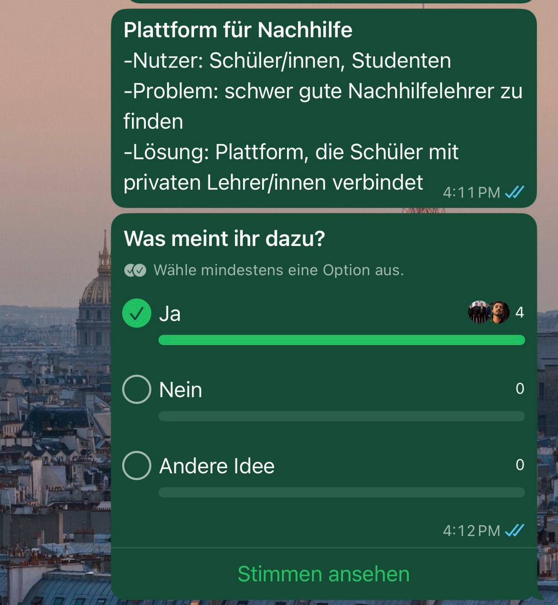

Ergebnis:

Alle Teammitglieder entschieden sich für die Nachhilfe-Plattform.

---

# 4. Entscheidung für die Nachhilfe-Plattform

Nach der Abstimmung legten wir unsere Projektidee fest.

## Nutzer

- Schüler/innen
- Studierende
- Tutor/innen
- Lehrkräfte

## Problem

Viele Schüler/innen haben Schwierigkeiten, vertrauenswürdige und passende Nachhilfelehrer/innen zu finden.

## Lösung

Eine Plattform, die Schüler/innen mit privaten Nachhilfelehrer/innen verbindet und eine einfache Suche sowie Buchung ermöglicht.

---

# 5. Persönliche Ziele und Repository

Nach der Projektauswahl haben wir:

- unsere persönlichen Ziele formuliert,
- das GitHub-Repository erstellt,
- GitHub Pages eingerichtet,
- die erste Projektdokumentation vorbereitet.

---

# 6. Erste UI-Skizzen (KI-generiert)

Zur Ideenfindung nutzten wir zunächst KI-generierte Entwürfe. Wir beschrieben unsere Vorstellungen und ließen erste Designs erstellen.

Dabei entstanden erste Skizzen für:

- Registrierung
- Anmeldung
- Suche
- Buchung

## Erste KI-Skizzen

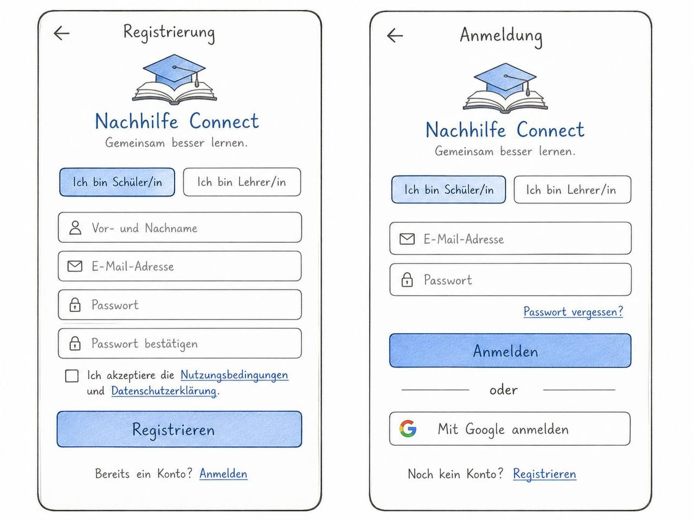

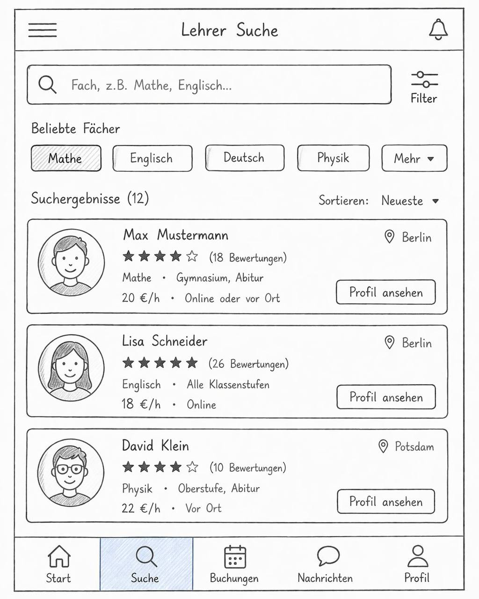

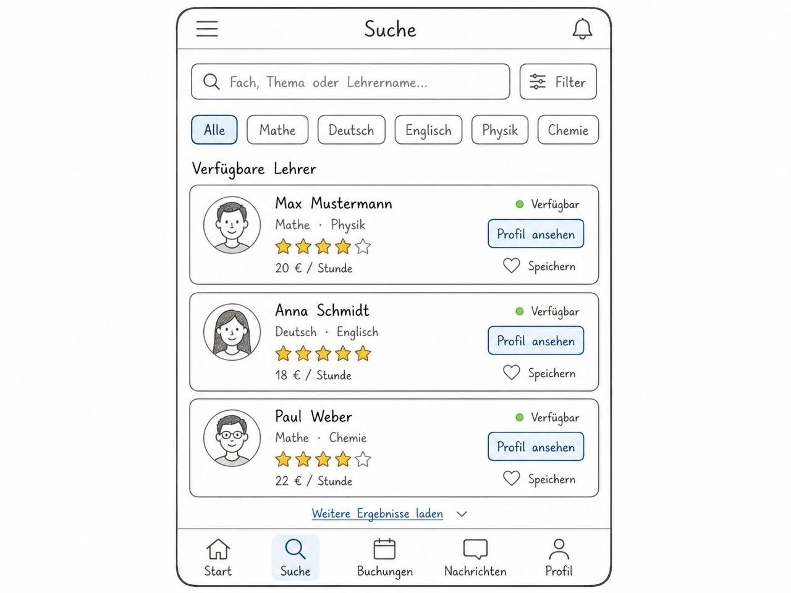

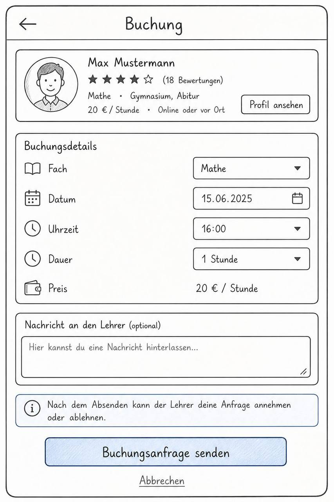

Diese Entwürfe dienten lediglich als Inspiration.

---

# 7. Überarbeitung der ersten Skizzen

Nach den ersten KI-generierten Entwürfen haben wir weitere Skizzen erstellt und unterschiedliche Layouts ausprobiert. Dabei entstanden Designs, die eher wie eine Mobile-App aufgebaut waren.

Während unserer Diskussion stellten wir jedoch fest, dass unser Projekt als Webanwendung umgesetzt werden soll und die Mobile-App-Darstellung daher nicht optimal zu unserem Ziel passt.

## Überarbeitete Skizzen

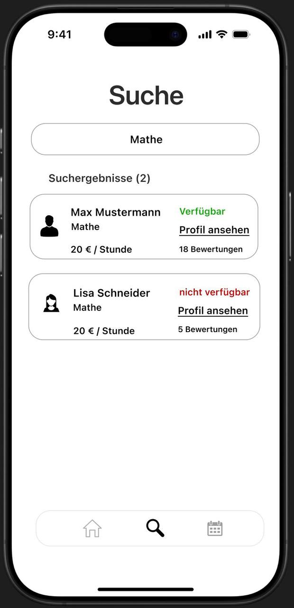

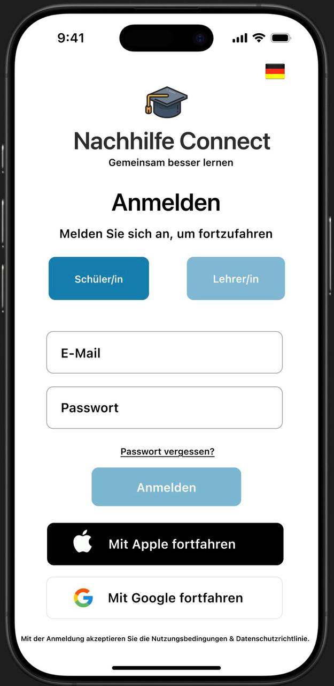

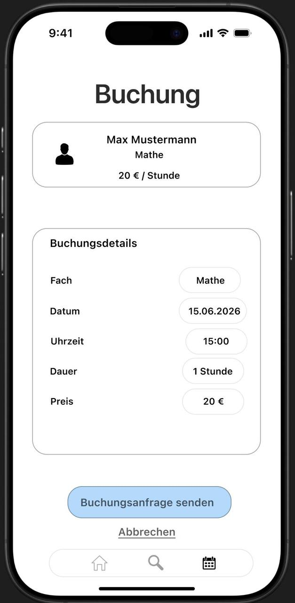

Diese Skizzen halfen uns dabei, Funktionen und Abläufe besser zu verstehen, wurden jedoch nicht als finale Lösung übernommen.

---

# 8. Finale Web-Skizzen vor dem ersten Feedback:

Auf Grundlage unserer bisherigen Überlegungen entwickelten wir anschließend konkrete Web-Skizzen. Dabei orientierten wir uns an einer klassischen Webanwendung und ergänzten realistischere Inhalte.

Diese Version wurde als erster vollständiger Entwurf dem Dozenten vorgestellt.

## Finale Web-Skizzen (vor dem ersten Feedback)
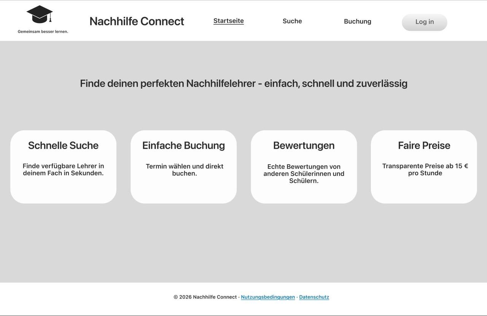

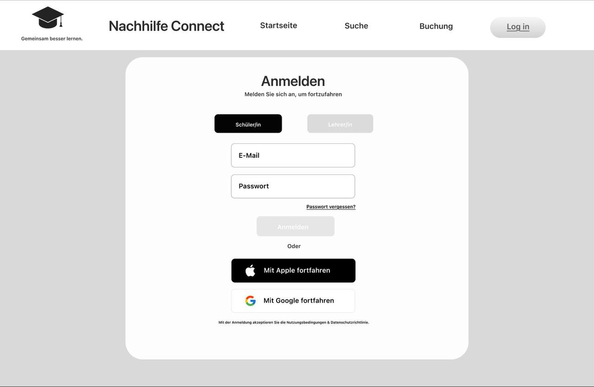

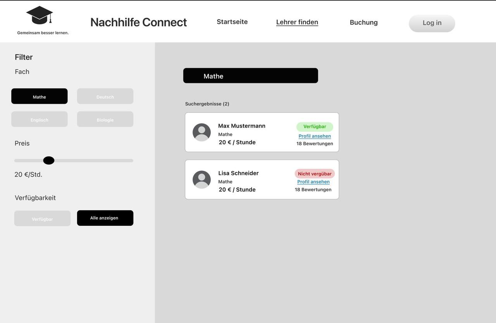

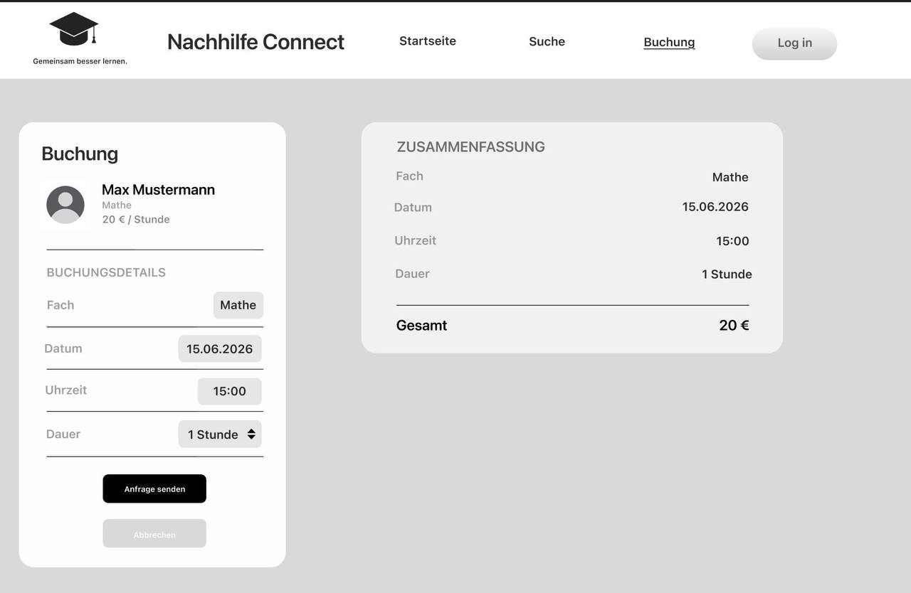

---

# 9. Weitere Teamarbeit

Im weiteren Verlauf haben wir:

- uns erneut persönlich getroffen,
- zweimal telefoniert,
- gemeinsam die nächsten Schritte geplant,
- offene Fragen diskutiert.

---

# 10. Erstes Feedback des Dozenten

Da wir am Feedback-Termin nicht teilnehmen konnten, erhielten wir das Feedback über Moodle.

Der Dozent wies insbesondere auf folgende Punkte hin:

- Zielgruppen genauer definieren.
- Matching zwischen Schülern und Lehrern verbessern.
- Vertrauens- und Sicherheitsmechanismen ergänzen.
- UI-Screens realistischer gestalten.

## Moodle-Feedback

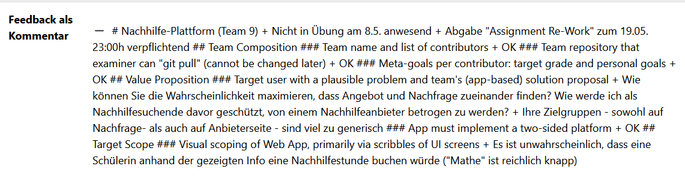

---

# 11. Umsetzung des Feedbacks

Auf Grundlage des Feedbacks haben wir unsere Lösung erweitert.

## Zielgruppe konkretisiert

- Schüler/innen der Klassen 10–13
- Studierende
- Tutor/innen
- Lehrkräfte

## Matching verbessert

- Fachfilter
- Preisfilter
- Bewertungen
- Verfügbarkeit
- Unterrichtsart

## Vertrauen und Sicherheit

- Verifizierte Profile
- Bewertungssystem
- Meldesystem
- Administrator-Prüfung

## UI verbessert

- Mehr Informationen in Lehrerprofilen
- Realistischere Buchungssituation
- Verbesserte Suchergebnisse

Diese Änderungen wurden anschließend in unserer Projektdokumentation (`index.md`) übernommen.

---

# 12. Zweites Feedback-Gespräch

Ein Teammitglied nahm an einem weiteren Gespräch mit dem Dozenten teil.

## Vorbereitete Fragen

- Reichen unsere Sicherheits- und Verifizierungskonzepte aus?
- Sind unsere aktuellen UI-Screens realistisch genug?

## Erhaltenes Feedback

- Templates dürfen verwendet werden.
- Verifizierungsnachweise sollten vereinfacht werden.
- Die Buchungsseite sollte aus Sicht der Schüler verbessert werden.

---

# 13. Vernetzungsplan

Um die Navigation unserer Anwendung besser zu verstehen, entwickelten wir einen Vernetzungsplan.

Dieser zeigt die wichtigsten Seiten und deren Beziehungen zueinander.

## Vernetzungsplan

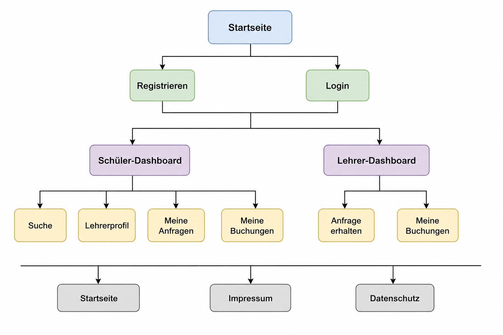

Die endgültige Version ist in der (`index.md`) dokumentiert.

---

# 14. Aufgabenverteilung im Team

Wir haben gemeinsam darüber gesprochen, welche Bereiche die einzelnen Teammitglieder bevorzugen und sich grundsätzlich vorstellen könnten zu übernehmen. Eine endgültige Aufgabenverteilung wurde zu diesem Zeitpunkt jedoch noch nicht festgelegt

## Aufgabenverteilung

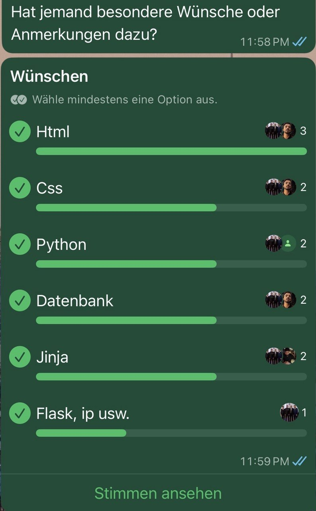

---

# 15. Vorbereitung auf die First Submission

Vor der ersten Abgabe haben wir die Anforderungen analysiert.

Dabei haben wir gemeinsam besprochen:

- Welche Anforderungen erfüllt werden müssen.
- Welche Nachweise benötigt werden.
- Welche technischen Bestandteile umgesetzt werden müssen.
- Wie wir unsere Arbeit dokumentieren.

Zusätzlich erstellten wir:

- ein PDF mit allen geplanten Arbeitsschritten in logischer Reihenfolge,
- eine Checkliste mit Fragen, damit keine Anforderungen vergessen werden.

---

# Fazit

Diese Dokumentation zeigt unseren Entwicklungsprozess von der ersten Idee bis zum aktuellen Stand der Nachhilfe-Plattform.

Sie verdeutlicht, wie wir Entscheidungen getroffen, Feedback verarbeitet und unsere Lösung schrittweise verbessert haben.