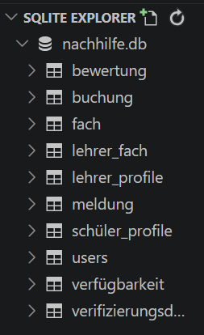
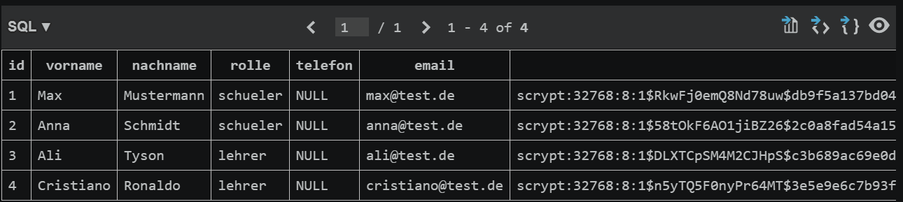
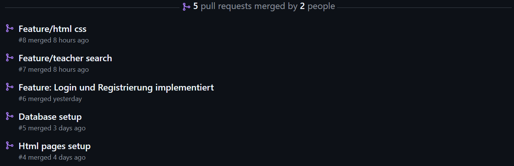

# Evidence / Raw Material

Diese Dokumentation zeigt unseren Entwicklungsprozess von der ersten Idee bis zum aktuellen Stand der Nachhilfe-Plattform.

---

# 1. Erste Anforderungen verstanden

Zu Beginn haben wir die Anforderungen der Lehrveranstaltung gemeinsam analysiert. Dabei haben wir folgende Aufgaben identifiziert:

- Team bilden
- Teammitglieder festlegen
- GitHub-Repository erstellen
- GitHub Pages einrichten
- Projektidee auswählen
- UI-Skizzen erstellen
- Persönliche Ziele definieren
- Alle Ergebnisse im Repository dokumentieren

---

# 2. Erste Projektideen

Bei unserem ersten Treffen haben wir mehrere Projektideen diskutiert.

## Idee 1: Nachhilfe-Plattform

- Schüler/innen finden passende Nachhilfelehrer/innen.
- Nachhilfelehrer/innen können ihre Angebote veröffentlichen.

## Idee 2: Parkplatz-App

- Nutzer können freie Parkplätze finden oder anbieten.
- Anzeige verfügbarer Parkplätze in der Umgebung.

## Idee 3: Lernpartner-Plattform

- Schüler/innen und Studierende finden Lernpartner/innen zum gemeinsamen Lernen.
- Austausch nach Fachgebieten und Interessen.

Da wir mehrere interessante Ideen hatten, beschlossen wir, die endgültige Entscheidung gemeinsam zu treffen.

---

# 3. WhatsApp-Abstimmung zur Projektauswahl

Um demokratisch zu entscheiden, welche Idee umgesetzt werden soll, haben wir eine Umfrage in unserer WhatsApp-Gruppe erstellt.

## WhatsApp-Umfrage

Ergebnis:

Alle Teammitglieder entschieden sich für die Nachhilfe-Plattform.

---

# 4. Entscheidung für die Nachhilfe-Plattform

Nach der Abstimmung legten wir unsere Projektidee fest.

## Nutzer

- Schüler/innen
- Studierende
- Tutor/innen
- Lehrkräfte

## Problem

Viele Schüler/innen haben Schwierigkeiten, vertrauenswürdige und passende Nachhilfelehrer/innen zu finden.

## Lösung

Eine Plattform, die Schüler/innen mit privaten Nachhilfelehrer/innen verbindet und eine einfache Suche sowie Buchung ermöglicht.

---

# 5. Persönliche Ziele und Repository

Nach der Projektauswahl haben wir:

- unsere persönlichen Ziele formuliert,
- das GitHub-Repository erstellt,
- GitHub Pages eingerichtet,
- die erste Projektdokumentation vorbereitet.

---

# 6. Erste UI-Skizzen (KI-generiert)

Zur Ideenfindung nutzten wir zunächst KI-generierte Entwürfe. Wir beschrieben unsere Vorstellungen und ließen erste Designs erstellen.

Dabei entstanden erste Skizzen für:

- Registrierung
- Anmeldung
- Suche
- Buchung

## Erste KI-Skizzen

Diese Entwürfe dienten lediglich als Inspiration.

---

# 7. Überarbeitung der ersten Skizzen

Nach den ersten KI-generierten Entwürfen haben wir weitere Skizzen erstellt und unterschiedliche Layouts ausprobiert. Dabei entstanden Designs, die eher wie eine Mobile-App aufgebaut waren.

Während unserer Diskussion stellten wir jedoch fest, dass unser Projekt als Webanwendung umgesetzt werden soll und die Mobile-App-Darstellung daher nicht optimal zu unserem Ziel passt.

## Überarbeitete Skizzen

Diese Skizzen halfen uns dabei, Funktionen und Abläufe besser zu verstehen, wurden jedoch nicht als finale Lösung übernommen.

---

# 8. Finale Web-Skizzen vor dem ersten Feedback:

Auf Grundlage unserer bisherigen Überlegungen entwickelten wir anschließend konkrete Web-Skizzen. Dabei orientierten wir uns an einer klassischen Webanwendung und ergänzten realistischere Inhalte.

Diese Version wurde als erster vollständiger Entwurf dem Dozenten vorgestellt.

## Finale Web-Skizzen (vor dem ersten Feedback)

---

# 9. Weitere Teamarbeit

Im weiteren Verlauf haben wir:

- uns erneut persönlich getroffen,
- zweimal telefoniert,
- gemeinsam die nächsten Schritte geplant,
- offene Fragen diskutiert.

---

# 10. Erstes Feedback des Dozenten

Da wir am Feedback-Termin nicht teilnehmen konnten, erhielten wir das Feedback über Moodle.

Der Dozent wies insbesondere auf folgende Punkte hin:

- Zielgruppen genauer definieren.
- Matching zwischen Schülern und Lehrern verbessern.
- Vertrauens- und Sicherheitsmechanismen ergänzen.
- UI-Screens realistischer gestalten.

## Moodle-Feedback

---

# 11. Umsetzung des Feedbacks

Auf Grundlage des Feedbacks haben wir unsere Lösung erweitert.

## Zielgruppe konkretisiert

- Schüler/innen der Klassen 10–13
- Studierende
- Tutor/innen
- Lehrkräfte

## Matching verbessert

- Fachfilter
- Preisfilter
- Bewertungen
- Verfügbarkeit
- Unterrichtsart

## Vertrauen und Sicherheit

- Verifizierte Profile
- Bewertungssystem
- Meldesystem
- Administrator-Prüfung

## UI verbessert

- Mehr Informationen in Lehrerprofilen
- Realistischere Buchungssituation
- Verbesserte Suchergebnisse

Diese Änderungen wurden anschließend in unserer Projektdokumentation (`index.md`) übernommen.

---

# 12. Zweites Feedback-Gespräch

Ein Teammitglied nahm an einem weiteren Gespräch mit dem Dozenten teil.

## Vorbereitete Fragen

- Reichen unsere Sicherheits- und Verifizierungskonzepte aus?
- Sind unsere aktuellen UI-Screens realistisch genug?

## Erhaltenes Feedback

- Templates dürfen verwendet werden.
- Verifizierungsnachweise sollten vereinfacht werden.
- Die Buchungsseite sollte aus Sicht der Schüler verbessert werden.

---

# 13. Vernetzungsplan

Um die Navigation unserer Anwendung besser zu verstehen, entwickelten wir einen Vernetzungsplan.

Dieser zeigt die wichtigsten Seiten und deren Beziehungen zueinander.

## Vernetzungsplan

Die endgültige Version ist in der (`index.md`) dokumentiert.

---

# 14. Aufgabenverteilung im Team

Wir haben gemeinsam darüber gesprochen, welche Bereiche die einzelnen Teammitglieder bevorzugen und sich grundsätzlich vorstellen könnten zu übernehmen. Eine endgültige Aufgabenverteilung wurde zu diesem Zeitpunkt jedoch noch nicht festgelegt

## Aufgabenverteilung

---

# 15. Vorbereitung auf die First Submission

Vor der ersten Abgabe haben wir die Anforderungen analysiert.

Dabei haben wir gemeinsam besprochen:

- Welche Anforderungen erfüllt werden müssen.
- Welche Nachweise benötigt werden.
- Welche technischen Bestandteile umgesetzt werden müssen.
- Wie wir unsere Arbeit dokumentieren.

Zusätzlich erstellten wir:

- ein PDF mit allen geplanten Arbeitsschritten in logischer Reihenfolge,
- eine Checkliste mit Fragen, damit keine Anforderungen vergessen werden.

---

# 16. Technische Umsetzung

Nach Abschluss der Planungsphase begann die technische Umsetzung der Anwendung. 

## Verwendete Technologien 

- Python
- Flask
- Jinja2
- SQLite
- SQLAlchemy
- HTML
- CSS
- Github

## Umgesetzte Funktionen

- Registrierung
- Login und Logout
- Lehrer-Suche
- Dynamische Lehrerprofile
- Schüler-Dashboard
- Lehrer-Dashboard
- Buchungsseite
- Profilseite
- JSON API für Nutzerdaten (/api/users)

## Datenbank

Die Datenbank wurde mit SQLite umgesetzt

Zur Entwicklung und zum Testen wurden zusätzlich Dummy-Daten erstellt, damit die wichtigsten Funktionen der PLattform bereits getestet werden können.

### Tabellenübersicht

### Beispielinhalt der Tabelle users

---

# 17. GitHub Workflow

Während der Entwicklung arbeiteten wir mit mehreren Feature-Branches.

Beispiele:

- feature/login-register
- feature/dummy-data
- feature/teacher-search
- feature/html-css

Die Änderungen wurden über Pull Requests überprüft und anschließend zusammengeführt.

### Pull-Request Beispiele

Die folgende Abbildung zeigt einen Ausschnitt der im Projekt verwendeten Pull Requests. Dadurch konnten neue Funktionen zunächst in separaten Feature-Branches entwickelt und anschließend kontrolliert in die Hauptbranches integriert werden.

---

# 18. Individuelle Beiträge

### Mohd Alkhtib

Meine Aufgaben umfassten sowohl organisatorische als auch technische Bereiche des Projekts. 

Top 3 Beiträge:

1. Organisation des Projekts
    - Erstellung und Verwaltung von Git-Branches
    - Aufgabenverteilung innerhalb des Teams
    - Unterstützung beim Zusammenführen von Branches
    (siehe Commits 25f373b, f944ca2, fdfc2eb – Merge Pull Requests)
2. Entwicklung der Anwendung
    - Mitarbeit an HTML-, CSS-, Python- und Jinja-Dateien
    - Erstellung des Vernetzungsplans
    - Unterstützung bei der Datenbankintegration
    (siehe Commits eeaec7f "Grundstruktur der Seiten und CSS angelegt", d0173b2 "Fehler 2 Lösung models.py", 6c661ce "Vernetzungsplan zugefügt") 
3. Dokumentation
    - Erstellung und Pflege von index.md und evidence.md
    - Strukturierung der Projektdokumenatation
    (siehe Commits 918fda1 "evidence ist fertig", f0f3114 "Update index.md")

Herausforderun: 
Die größte Herausforderung war zunächst das Verständnis von GitHub, Flask und der Zusammenarbeit über mehrere Branches hinweg. Mit zunehmender Erfahrung wurden diese Themen einfacher, wodurch neue Herausforderungen entstanden, insbesondere die Verwaltung vieler voneinander abhängiger Dateien.

Darauf bin ich stolz:
Ich bin stolz darauf, gemeinsam mit meinem Team ein umfangreiches Projekt mit mehreren neuen Technologien erfolgreich umgesetzt zu haben.

### Benyamin Hasan

Top 3 Beiträge:

1. Erstellung und Überarbeitung der UI-Skizzen
(siehe Commits f769a20, 79a1c99 "Add files via upload" Mockups)
2. Mitarbeit an Flask-, Python- und Datenbank-Komponenten
(siehe Commits ddc66b3 "Alle Routen in app.py hinzugefügt", a142dae "Lehrersuche und Lehrerprofil mit echten Datenbank-Daten verbunden", b310dd3 "Filterlogik für Fach, Preis und Unterrichtsart implementiert")
3. Erstellung und Pflege von Dummy-Daten
(siehe Commit 1815f1b "Testdaten in seed_data.py erstellt und erfolgreich getestet") 

Herausforderung:
Eine große Herausforderung war die Verknüpfung der Datenbank mit Flask und den HTML-Seiten. Dabei mussten mehrere Komponenten gleichzeitig funktionieren und korrekt miteinander kommunizieren.

Darauf bin ich stolz:
Ich bin stolz darauf, Aufgaben zuverlässig und schnell bearbeitet zu haben. Außerdem habe ich das Team bei Branches, Pull Requests und Merge-Prozessen unterstützt.

### Abdullah Aldarwish

Top 3 Beiträge:

1. Erstellung des Datenmodells
(siehe Commits f7b3dc6 "Tabelle User einfügen", 6c0dc87 "SchülerProfil-Tabelle ergänzt", 615e7c4 "Lehrerprofil-Tabelle", 3a0268d "Tabellen Fach and LehrerFach zugefügt", b34a80d "Verifizierungsdokument ergänzt", e1cbba6 "Verfügbarkeit Tabelle ergänzt", b84fe9f "Add Bewertung and Meldung Tabellen")
2. Mitarbeit an Datenbank, HTML und CSS
(siehe Commits dea35ed "Initialisiere SQLAlchemy in db.py", 98ce04a "Datenbank für die Flask konfigurieren und initialisieren", d70890d "teacher_profile.html fertig")
3. Unterstützung bei Python-Komponenten
(siehe Commits 5ee77e6 "update app.py", 05fbe2e "teacher_name zur Buchungsroute hinzugefügt")

Herausforderung:
Die größte Herausforderung bestand darin, das Datenmodell korrekt zu planen und die Beziehungen zwischen den Tabellen zu verstehen.

Darauf bin ich stolz:
Zu Beginn erschien mir das gesamte Projekt sehr komplex. Durch Erklärungen, Übung und Teamarbeit konnte ich die Zusammenhänge verstehen und erfolgreich an der Umsetzung mitarbeiten.

### Emrah Rabotic

Top 3 Beiträge:

1. Implementierung von Login und Registrierung
(siehe Commits c0f9285 "Login und Registrierung erstellt", e88f716 "Implementierung einer Anmeldefunktionalität", 3562b3a "Implementierung der Benutzerregistrierung mit Validierung und Speicherung in der Datenbank")
2. Mitarbeit an Flask- und Python-Komponenten
(siehe Commits b8da9d1 "JSON-API hinzugefügt", b74a465 "JSON-API hinzugefügt", bcdab00 "password hashing Funktion und forms importieren")
3. Erstellung von HTML- und CSS-Seiten
(siehe Commits 01c3a63 "teacher_search.html fertig", 133da4c "booking.html fertig", dcfe111 "Update CSS Datei")

Herausforderung:
Die größte Herausforderung war das Erlernen neuer Technologien wie Flask und die Verknüpfung von Backend und Frontend.

Darauf bin ich stolz:
Ich hatte vor dem Projekt nur wenig Erfahrung mit Python. Deshalb bin ich besonders stolz darauf, dass ich aktiv an der Entwicklung zentraler Funktionen wie Login und Registrierung mitarbeiten konnte.

---

# 19. Demonstrationsvideo

Zur Dokumentation des aktuellen Projektstands wurde ein Demonstrationsvideo erstellt.

Das Video zeigt die wichtigsten Funktionen der Nachhilfe-Plattform:

* Registrierung und Login
* Lehrer-Suche
* Lehrerprofil
* Buchungsanfrage
* Schüler-Dashboard
* Lehrer-Dashboard
* Verwaltung von Anfragen und Terminen
* Bewertungssystem

Das Demonstrationsvideo dient als Nachweis der implementierten Funktionen und des aktuellen Entwicklungsstands.

---

# 20. Weiterentwicklung nach der Oral Examination

Nach der mündlichen Prüfung haben wir den bisherigen Projektstand ausgewertet und die im Ausblick angekündigten Verbesserungen priorisiert.

Dabei konzentrierten wir uns besonders auf:

- Erweiterung der Lehrersuche
- Verbesserung der Navigation
- Ausbau der Administratorfunktionen
- Verifizierung hochgeladener Dokumente
- Meldung und Sperrung problematischer Nutzerkonten
- Aktualisierung des Vernetzungsplans
- Bereinigung und Strukturierung des Codes
- Aktualisierung der Projektdokumentation

---

# 21. Erweiterung der Lehrersuche

Die Lehrersuche wurde funktional erweitert.

Zusätzlich zu Fach, Unterrichtsart und Preis können Nutzer/innen nun nach folgenden Kriterien filtern:

- Mindestbewertung
- Klassenstufe
- Verfügbarkeit

Außerdem können die Suchergebnisse sortiert werden:

- nach Bewertung
- nach aufsteigendem Preis
- nach absteigendem Preis

Durch diese Erweiterungen können Schüler/innen schneller passende Nachhilfelehrer/innen finden.

---

# 22. Administratorfunktion

Für die Final Submission wurde ein geschützter Administratorbereich umgesetzt.

Administratoren können sich nicht über das öffentliche Registrierungsformular registrieren. Das Administratorkonto wird intern über die Testdaten erstellt.

Der Administratorbereich umfasst:

- Admin-Dashboard
- Anzeige offener Verifizierungsdokumente
- Annahme oder Ablehnung von Dokumenten
- Anzeige gemeldeter Profile
- Markierung von Meldungen als erledigt
- Sperrung von Nutzerkonten
- Entsperrung gesperrter Nutzerkonten

Alle Admin-Routen werden durch einen eigenen Decorator geschützt. Dadurch können nur eingeloggte Nutzer mit der Rolle `admin` auf diese Seiten zugreifen.

---

# 23. Verifizierungsdokumente

Bei der Registrierung laden Nutzer/innen einen Nachweis hoch.

Für Lehrer/innen wird ein Eintrag in der Tabelle `Verifizierungsdokument` erstellt. Dieser enthält:

- Dokumenttyp
- Dateipfad
- Status
- Upload-Zeitpunkt
- optionale Administratornotiz

Der Status ist zunächst `ausstehend`.

Administratoren können das Dokument später:

- akzeptieren
- ablehnen

Bei einer Entscheidung wird zusätzlich der Verifizierungsstatus des zugehörigen Lehrerprofils aktualisiert.

---

# 24. Meldesystem und Kontosperrung

Schüler/innen können ein Lehrerprofil melden.

Dabei werden folgende Informationen gespeichert:

- meldender Nutzer
- gemeldeter Nutzer
- Grund der Meldung
- Status
- Erstellungszeitpunkt

Administratoren können Meldungen prüfen und als erledigt markieren.

Zusätzlich wurde die Tabelle `User` um das Feld `ist_gesperrt` erweitert.

Wenn ein Konto gesperrt ist, wird der Login abgelehnt und eine entsprechende Meldung angezeigt. Administratoren können gesperrte Konten später wieder entsperren.

---

# 25. Aktualisierung des Datenmodells

Das Datenmodell wurde für die Final Submission erweitert.

Neue beziehungsweise erweiterte Bereiche:

- Rolle `admin` in der Tabelle `User`
- Feld `ist_gesperrt` in der Tabelle `User`
- Tabelle `Verifizierungsdokument`
- Tabelle `Meldung`
- Beziehungen zwischen Meldungen und Nutzern
- Verifizierungsstatus in Schüler- und Lehrerprofilen

Dadurch unterstützt das Datenmodell nun zusätzlich Dokumentprüfung, Meldungsverwaltung und Kontosperrung.

---

# 26. Aktualisierung des Vernetzungsplans

Der Vernetzungsplan wurde an den aktuellen Implementierungsstand angepasst.

Neu ergänzt wurden:

- Admin-Dashboard
- Dokumente prüfen
- Meldungen
- Nutzer sperren und entsperren
- Lehrer melden
- Bewertung abgeben
- Nachhilfe anbieten
- Profil bearbeiten
- Nutzungsbedingungen

Der Plan unterscheidet nun klar zwischen:

- Schüler-Bereich
- Lehrer-Bereich
- Admin-Bereich
- globalen Seiten

---

# 27. Test der Administratorfunktionen

Die Administratorfunktionen wurden manuell getestet.

## Testfall 1: Admin-Login

- Anmeldung mit internem Administratorkonto
- Weiterleitung zum Admin-Dashboard
- Zugriff auf Admin-Seiten erfolgreich

## Testfall 2: Dokumentprüfung

- neuen Lehrer registriert
- Verifizierungsdokument hochgeladen
- Dokument im Admin-Bereich angezeigt
- Dokument akzeptiert und abgelehnt
- Verifizierungsstatus wurde korrekt aktualisiert

## Testfall 3: Lehrer melden

- Anmeldung als Schüler/in
- Lehrerprofil geöffnet
- Meldung mit Grund abgesendet
- Meldung im Admin-Bereich angezeigt

## Testfall 4: Nutzer sperren

- gemeldeten Nutzer durch Administrator gesperrt
- erneuter Login des gesperrten Nutzers wurde verhindert

## Testfall 5: Nutzer entsperren

- Nutzer durch Administrator entsperrt
- Login war danach wieder möglich

---

# 28. Bereinigung und Fehlerbehebung

Während der Finalisierung wurden mehrere technische Probleme behoben.

Beispiele:

- fehlende Pflichtfelder bei der Erstellung eines Lehrerprofils ergänzt
- Speicherung von Verifizierungsdokumenten korrigiert
- Datenbankbeziehungen ergänzt
- Einrückungsfehler in Admin-Routen behoben
- Navigation zwischen Rollenbereichen verbessert
- ungenutzte beziehungsweise veraltete Seiten identifiziert
- Vernetzungsplan und Dokumentation aktualisiert

---

# Fazit

Diese Dokumentation zeigt den Entwicklungsprozess unserer Nachhilfe-Plattform von der ersten Idee bis zur Final Submission.

Im Verlauf des Projekts haben wir Anforderungen analysiert, verschiedene Projektideen verglichen, UI-Skizzen entwickelt, Feedback verarbeitet und die Anwendung schrittweise technisch umgesetzt.

Für die Final Submission wurde die Plattform besonders in den Bereichen Suche, Sicherheit und Verwaltung erweitert. Die Lehrersuche bietet zusätzliche Filter- und Sortiermöglichkeiten. Außerdem wurden eine Administratorfunktion, die Prüfung von Verifizierungsdokumenten, ein Meldesystem sowie die Sperrung und Entsperrung von Nutzerkonten umgesetzt.

Diese Erweiterungen unterstützen unsere Value Proposition direkt: Schüler/innen können schneller passende und vertrauenswürdige Nachhilfelehrer/innen finden, während Lehrkräfte ihre Angebote professionell präsentieren und verwalten können.

Durch die Arbeit mit Flask, SQLAlchemy, Jinja2, HTML, CSS, Git und GitHub konnten wir sowohl technische Kenntnisse als auch Erfahrungen in Teamarbeit, Aufgabenverteilung und gemeinsamer Softwareentwicklung sammeln.