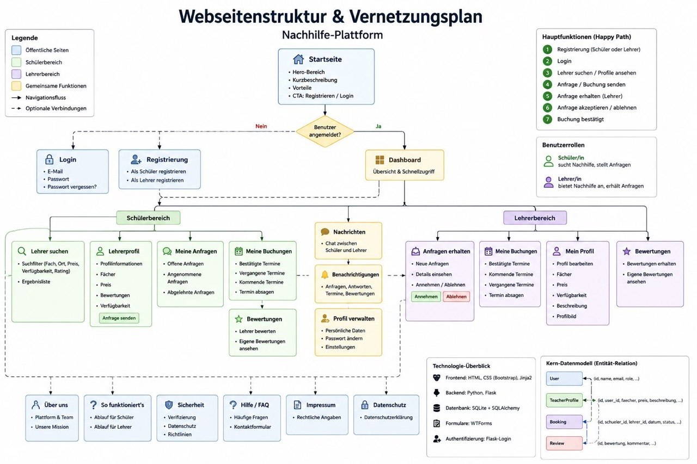

# Design Decisions

Diese Seite dokumentiert wichtige Designentscheidungen, die während der Entwicklung der Nachhilfe-Plattform getroffen wurden.

Jede Entscheidung beschreibt das zugrunde liegende Problem, mögliche Alternativen, die getroffene Entscheidung sowie die Begründung.

---

## Mohd Alkhtib
### Design Decision 1: Zentrale CSS-Datei

#### Problem Statement
Für die Webanwendung mussten mehrere HTML-Seiten gestaltet werden, darunter die Startseite, Login, Registrierung, Lehrersuche, Lehrerprofil sowie die Dashboards für Schüler/innen und Lehrkräfte.

Die Frage war, ob für jede Seite eine eigene CSS-Datei erstellt werden soll oder ob eine gemeinsame CSS-Datei für das gesamte Projekt verwendet wird.

#### Decision
Wir haben uns für eine zentrale CSS-Datei (style.css) entschieden.

Da viele Seiten gemeinsame Elemente wie Header, Navigation, Buttons, Formulare und Container verwenden, konnten diese Stile zentral definiert und wiederverwendet werden.

Dadurch mussten identische CSS-Regeln nicht mehrfach in verschiedenen Dateien gepflegt werden.

Die Entscheidung wurde von Mohd Alkhtib vorgeschlagen und anschließend im Team abgestimmt.

#### Regarded Options

| Option | Vorteile | Nachteile |
|---|---|---|
| Eine CSS-Datei pro Seite | Bessere Trennung der einzelnen Seitendesigns | Viele doppelte CSS-Regeln, höherer Pflegeaufwand |
| Eine zentrale CSS-Datei | Wiederverwendung gemeinsamer Komponenten, einfachere Wartung, konsistentes Design | Datei wird mit zunehmender Projektgröße größer |

#### Begründung
Da viele Seiten dieselbe Navigation und ähnliche Layout-Komponenten verwenden, wäre bei mehreren CSS-Dateien derselbe Code mehrfach vorhanden gewesen.

Mit einer zentralen CSS-Datei konnten gemeinsame Stile nur einmal definiert werden. Änderungen an der Navigation oder am allgemeinen Design mussten dadurch nur an einer Stelle vorgenommen werden.

Für den Umfang unseres Projekts war eine einzelne CSS-Datei die einfachere und wartungsfreundlichere Lösung.

### Design Decision 2: Gestaltung des Vernetzungsplans

#### Problem Statement
Für die Nachhilfe-Plattform musste ein Vernetzungsplan erstellt werden, der die Navigation der Anwendung verständlich darstellt.

Die Herausforderung war, eine passende Balance zwischen Vollständigkeit und Übersichtlichkeit zu finden. Der Plan sollte die wichtigsten Seiten, Benutzerrollen und Navigationswege zeigen, ohne zu kompliziert oder unübersichtlich zu wirken.

#### Decision
Es wurden mehrere Versionen des Vernetzungsplans erstellt und miteinander verglichen.

Die erste Version mit dem Titel „Webseitenstruktur & Vernetzungsplan“ war sehr detailliert. Sie enthielt viele Informationen, Rollen, Funktionen und technische Hinweise. Dadurch war sie zwar vollständig, aber für unsere Dokumentation zu komplex und schwer überschaubar. 

Die zweite Version ohne Titel war einfacher aufgebaut. Diese Version war jedoch inhaltlich nicht überzeugend, da die Struktur nicht klar genug waren. (in der "evidence.md" dokumentiert)

Am Ende haben wir uns für die dritte Version mit dem Titel „Vernetzungsplan“ entschieden. Diese Version zeigt die wichtigsten Seiten und Verbindungen klarer und einfacher. Sie hat unsere weitere Arbeit erleichtert, weil wir dadurch besser verstanden haben, welche Seiten benötigt werden und wie Nutzer/innen durch die Anwendung navigieren. (in der "index.md" dokumentiert)

Die Entscheidung wurde von Mohd Alkhtib vorbereitet und anschließend mit dem Team abgestimmt.

#### Regarded Options

| Option | Vorteile | Nachteile |
|----------|----------|----------|
| Sehr detaillierter Vernetzungsplan („Webseitenstruktur & Vernetzungsplan“) | Viele Informationen, Rollen und Funktionen enthalten | Zu komplex, schwer überschaubar, für unsere Projektphase zu umfangreich |
| Vereinfachte farbige Version ohne Titel | Einfachere Darstellung, verschiedene Bereiche farblich getrennt | Farben und Struktur waren nicht klar genug, wirkte nicht vollständig durchdacht |
| Finale Version „Vernetzungsplan“ | Klar, übersichtlich, zeigt die wichtigsten Seiten und Wege, erleichtert die weitere Arbeit | Weniger Detailtiefe als die erste Version |

#### Begründung
Die finale Version wurde gewählt, weil sie am besten zu unserem Projektstand passt. Sie zeigt die wichtigsten Bereiche der Plattform, ohne den Leser mit zu vielen Details zu überfordern.

Außerdem unterstützt sie unseren Happy Path besser: Von der Startseite über Registrierung und Login bis zu den Dashboards und den wichtigsten Funktionen wie Suche, Lehrerprofil, Buchung und rechtlichen Seiten.

Durch diese Entscheidung konnten wir klarer festlegen, welche Seiten für die Umsetzung wichtig sind und wie die Navigation in der Anwendung aufgebaut sein soll.

---

## Benyamin Hasan
###  Design Decision 1: Lösung des Merge-Konflikts in forms.py

#### Problem Statement

Beim Mergen des Branches feature/login-register in main trat ein Konflikt in der Datei forms.py auf. Mein lokaler Stand von forms.py war noch leer (die Datei war nur angelegt, aber nicht befüllt), während der Branch feature/login-register bereits die fertigen WTForms-Klassen RegisterForm und LoginForm mit Validierung für E-Mail, Passwort und Rolle enthielt.

Git konnte nicht automatisch entscheiden, welcher Inhalt in main übernommen werden soll, da beide Branches die Datei unterschiedlich verändert hatten.

#### Decision

Ich habe mich entschieden, den vollständigen Code aus feature/login-register zu übernehmen und meinen leeren Stand zu verwerfen.

Die Entscheidung wurde von Benyamin Hasan getroffen, da der Konflikt inhaltlich eindeutig war.

#### Regarded Options

| Option | Vorteile | Nachteile |
|---|---|---|
| Manuelles Lösen durch Übernahme des vollständigen Codes | Sofort gelöst, kein Datenverlust, Verständnis für Konfliktmarker gewonnen | Bei komplexeren Konflikten höheres Fehlerrisiko |
| Merge abbrechen und Teammitglied selbst mergen lassen | Person mit mehr Kontext löst es korrekt | Verzögerung, da auf Teammitglied gewartet werden muss |

#### Begründung

Da mein Stand von forms.py leer war und keinen eigenen Code enthielt, der erhalten werden musste, war die Übernahme des vollständigen Codes aus dem Feature-Branch die naheliegende und risikoärmste Lösung. Eine Kombination beider Versionen war nicht sinnvoll, da es nichts gab, das kombiniert werden konnte.

#### Nachweise

- Merge-Konflikt-Meldung im Terminal: `CONFLICT (content): Merge conflict in forms.py`
- Commit-Verlauf in main nach dem Merge von feature/login-register
- Datei `forms.py` mit den übernommenen Klassen RegisterForm und LoginForm

### Design Decision 2: Datum und Uhrzeit in Testdaten für SQLAlchemy

#### Problem Statement

Beim Erstellen von Testdaten in seed_data.py sollten Buchungen mit festem Datum und fester Uhrzeit angelegt werden. Der erste Versuch übergab Datum und Uhrzeit als reine Zeichenketten (datum="2026-06-25", uhrzeit="14:00"). Beim Ausführen von seed_data.py schlug dies fehl mit der Fehlermeldung TypeError: SQLite Date type only accepts Python date objects as input, da die Spalten datum und uhrzeit in models.py als db.Date und db.Time definiert sind.

#### Decision

Ich habe das Python-Modul datetime importiert und Datum sowie Uhrzeit als echte date- und time-Objekte übergeben (date(2026, 6, 25), time(14, 0)), statt das Datenmodell selbst zu ändern.

Die Entscheidung wurde von Benyamin Hasan getroffen.

#### Regarded Options

| Option | Vorteile | Nachteile |
|---|---|---|
| Verwendung von date()/time()-Objekten | Entspricht direkt der Erwartung von SQLAlchemy, keine Änderung am Datenmodell nötig, garantiert gültige Werte | Erfordert zusätzlichen Import |
| Änderung der Spaltentypen in models.py zu String | Würde Zeichenketten direkt erlauben | Würde ungültige Eingaben ermöglichen, Änderung am Datenmodell würde Absprache mit Person 2 erfordern |

#### Begründung

Die Verwendung von date()- und time()-Objekten war die naheliegendere Lösung, weil sie keine Absprache mit dem Team erforderte und die Datenintegrität der Datenbank nicht schwächt. Eine Änderung der Spaltentypen hätte zudem alle anderen Stellen im Projekt betroffen, die diese Spalten verwenden.

#### Nachweise

- Fehlermeldung im Terminal bei der ersten Ausführung von seed_data.py
- Erfolgreiche Ausführung nach der Korrektur, mit Ausgabe "Testdaten erfolgreich erstellt!"
- Commit-Verlauf der Datei seed_data.py

---

## Abdullah Aldarwish
### Design Decision 1: Gestaltung des Datenmodells

#### Problem Statement

Für die Nachhilfe-Plattform musste ein Datenmodell erstellt werden, das die wichtigsten Bereiche der Anwendung abbildet.

Dabei musste entschieden werden, ob die Plattform mit wenigen einfachen Tabellen umgesetzt wird oder ob mehrere Tabellen mit klaren Beziehungen verwendet werden. Besonders wichtig war die Frage, wie Nutzer/innen, Schülerprofile, Lehrerprofile, Fächer, Buchungen und Bewertungen miteinander verbunden werden.

#### Decision

Wir haben uns für ein detailliertes Datenmodell mit mehreren verbundenen Tabellen entschieden.

Dazu gehören unter anderem:

- User
- SchülerProfil
- LehrerProfil
- Fach
- LehrerFach
- Buchung
- Bewertung
- Meldung
- Verifizierungsdokument

Die Entscheidung wurde von Abdullah Aldarwish vorbereitet und anschließend im Team abgestimmt.

#### Regarded Options

| Option | Vorteile | Nachteile |
|---|---|---|
| Einfaches Datenmodell mit wenigen Tabellen | Schnell umzusetzen, weniger Komplexität | Viele Informationen müssten in wenigen Tabellen gespeichert werden, schlechter erweiterbar |
| Detailliertes Datenmodell mit mehreren Tabellen | Klare Struktur, bessere Beziehungen zwischen Daten, näher an der echten Anwendung | Mehr Planungsaufwand und komplexere Umsetzung |

#### Begründung

Die detaillierte Lösung wurde gewählt, weil unsere Plattform mehrere unterschiedliche Bereiche benötigt. Schüler/innen, Lehrer/innen, Fächer, Buchungen und Bewertungen haben unterschiedliche Informationen und sollten deshalb sauber voneinander getrennt werden.

Durch die getrennten Tabellen können Daten besser miteinander verknüpft werden. Zum Beispiel kann eine Buchung eindeutig mit einem Schüler, einem Lehrer und einem Fach verbunden werden.

Für unser Projekt war diese Struktur sinnvoll, weil sie besser zum geplanten Happy Path und zu den Anforderungen der Nachhilfe-Plattform passt.

#### Nachweise

- Datenmodell in `index.md`
- Umsetzung in `models.py`
- Datenbank-Screenshot in `evidence.md`

### Design Decision 2: SQLite als Datenbank

#### Problem Statement

Für die Nachhilfe-Plattform musste entschieden werden, welche Datenbanktechnologie verwendet wird.

Die Anwendung sollte lokal auf einem Windows- oder MacOS-System ausführbar sein und ohne komplizierte Serverinstallation funktionieren. Gleichzeitig mussten Nutzer/innen, Profile, Fächer, Buchungen und Bewertungen gespeichert werden können.

#### Decision

Wir haben uns für SQLite als Datenbank entschieden.

SQLite speichert die Daten in einer lokalen Datenbankdatei und benötigt keinen zusätzlichen Datenbankserver. Dadurch konnte die Anwendung einfacher eingerichtet, getestet und für die First Submission vorbereitet werden.

Die Entscheidung wurde von Abdullah Aldarwish vorbereitet und anschließend im Team abgestimmt.

#### Regarded Options

| Option | Vorteile | Nachteile |
|---|---|---|
| SQLite | Einfach einzurichten, keine Serverinstallation nötig, gut für lokale Entwicklung geeignet | Weniger geeignet für große produktive Anwendungen |
| MySQL oder PostgreSQL | Leistungsfähiger und besser für große Anwendungen geeignet | Zusätzliche Installation und Konfiguration notwendig |
| Keine Datenbank, nur feste Dummy-Daten im Code | Sehr einfach für erste Tests | Keine echte Speicherung, passt nicht zu Login, Profilen und Buchungen |

#### Begründung

SQLite wurde gewählt, weil es für den Umfang unseres Hochschulprojekts ausreichend ist und die Anwendung dadurch leicht lokal gestartet werden kann.

Außerdem passt SQLite gut zu Flask und SQLAlchemy. Die Datenbankdatei kann direkt im Projekt verwendet werden, wodurch der Prüfer die Anwendung einfacher reproduzieren kann.

Für die First Submission war SQLite deshalb die einfachste und sinnvollste Lösung.

#### Nachweise

- Datei `instance/nachhilfe.db`
- Datenbank-Screenshot in `evidence.md`
- Datenbankkonfiguration in `app.py`

---

## Emrah 
###  Design Decision 1: Umsetzung von Login und Registrierung mit Flask-WTF
#### Problem Statement

Für die Nachhilfe-Plattform musste entschieden werden, wie Login und Registrierung umgesetzt werden sollen.

Dabei stellte sich die Frage, ob die Eingaben direkt über normale HTML-Formulare verarbeitet werden oder ob ein Formular-Framework verwendet wird. Außerdem musste entschieden werden, ob Login und Registrierung auf einer gemeinsamen Seite oder auf getrennten Seiten umgesetzt werden.

#### Decision

Wir haben uns für Flask-WTF und WTForms entschieden.

Zusätzlich wurden Login und Registrierung als zwei getrennte Funktionen mit eigenen Routen umgesetzt:

- `/login`
- `/register`

Dadurch konnten die Formulare einfacher validiert und die Benutzerführung klarer gestaltet werden.

Die Entscheidung wurde von Emrah Rabotic vorbereitet und anschließend im Team abgestimmt.

#### Regarded Options

| Option | Vorteile | Nachteile |
|---|---|---|
| Normale HTML-Formulare ohne WTForms | Einfacher Einstieg, weniger zusätzliche Bibliotheken | Mehr manueller Code für Validierung und Fehlerbehandlung |
| Flask-WTF mit WTForms und getrennten Routen | Strukturierte Formulare, integrierte Validierung, bessere Wartbarkeit | Zusätzliche Einarbeitung notwendig |
| Login und Registrierung auf einer gemeinsamen Seite | Weniger Seiten | Komplexere Logik und schlechtere Übersicht |

#### Begründung

Flask-WTF bietet bereits viele Funktionen für die Formularverarbeitung und Validierung. Dadurch konnten Pflichtfelder, E-Mail-Adressen und Passwortregeln einfacher überprüft werden.

Außerdem sorgen getrennte Seiten für Login und Registrierung für einen klaren Ablauf und eine bessere Benutzerfreundlichkeit. Nutzer/innen wissen dadurch sofort, ob sie sich anmelden oder registrieren möchten.

Für den Umfang unseres Projekts war diese Lösung die übersichtlichste und wartungsfreundlichste Variante.

#### Nachweise

- `forms.py`
- `app.py`
- Login-Seite
- Registrierungsseite

###  Design Decision 2: Passwort-Hashing statt Klartextspeicherung
#### Problem Statement

Bei der Entwicklung des Login- und Registrierungssystems musste entschieden werden, wie Passwörter gespeichert werden sollen.

Dabei stellte sich die Frage, ob Passwörter direkt als Klartext in der Datenbank gespeichert werden oder ob sie vor der Speicherung verschlüsselt bzw. gehasht werden.

#### Decision

Wir haben uns für Passwort-Hashing mit den Werkzeug-Funktionen entschieden:

- `generate_password_hash()`
- `check_password_hash()`

Dadurch werden Passwörter nicht direkt in der Datenbank gespeichert.

Die Entscheidung wurde von Emrah Rabotic vorbereitet und anschließend im Team abgestimmt.

#### Regarded Options

| Option | Vorteile | Nachteile |
|---|---|---|
| Speicherung als Klartext | Einfach umzusetzen | Sehr unsicher, Passwörter sind direkt sichtbar |
| Passwort-Hashing mit Werkzeug | Höhere Sicherheit, bewährte Lösung in Flask-Projekten | Etwas mehr Implementierungsaufwand |

#### Begründung

Die Speicherung von Passwörtern im Klartext stellt ein Sicherheitsrisiko dar. Jeder mit Zugriff auf die Datenbank könnte die Passwörter aller Nutzer/innen lesen.

Durch die Verwendung von Passwort-Hashing werden nur verschlüsselte Hash-Werte gespeichert. Beim Login wird das eingegebene Passwort mit dem gespeicherten Hash verglichen.

Dadurch wird die Sicherheit der Anwendung verbessert und gleichzeitig eine professionelle Vorgehensweise umgesetzt.

#### Nachweise

- `app.py`
- Funktionen `generate_password_hash()`
- Funktionen `check_password_hash()`
- Registrierungs- und Login-Prozess
