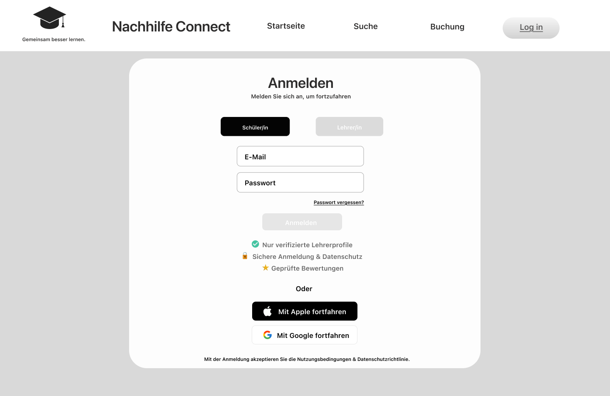
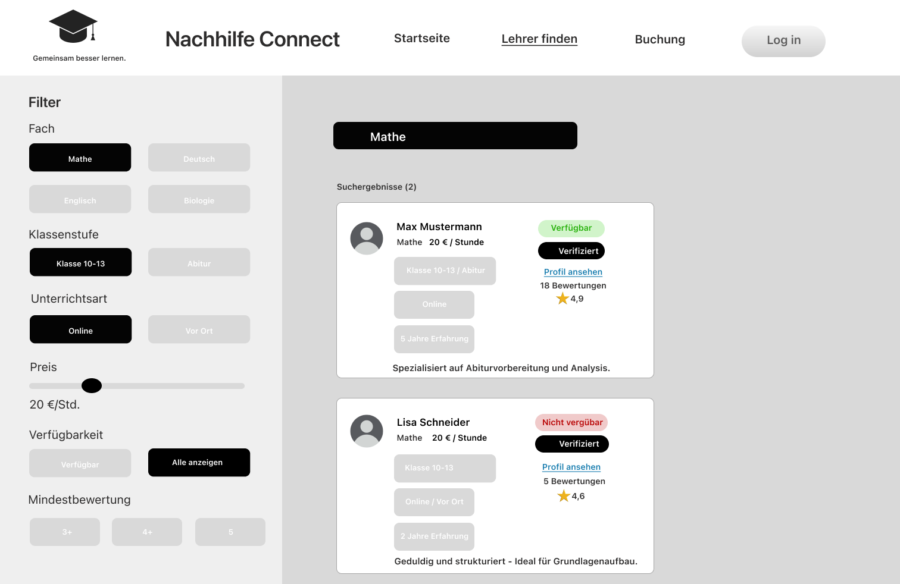
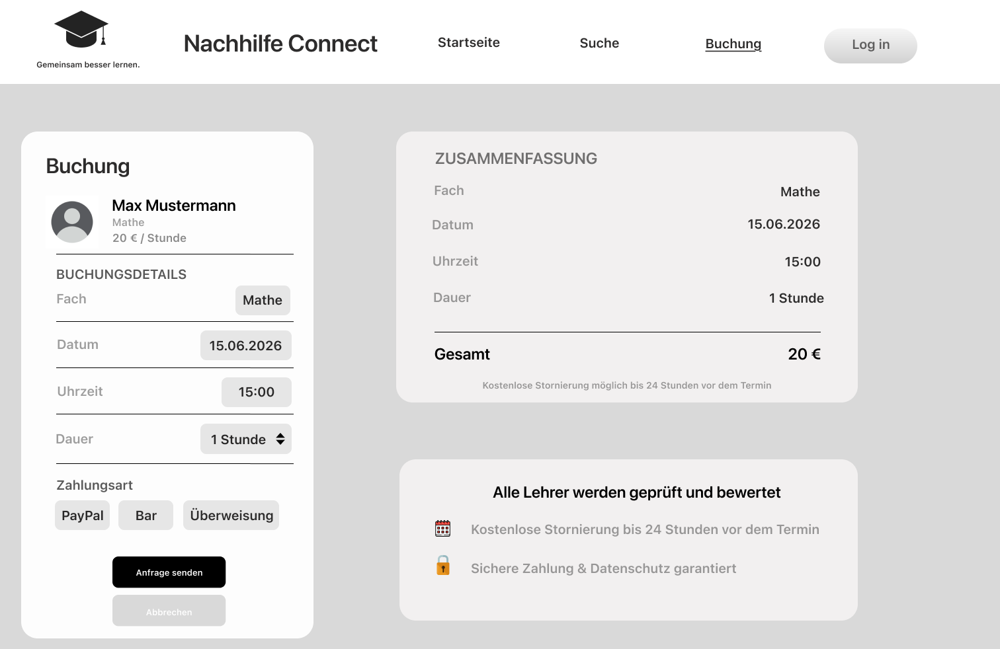
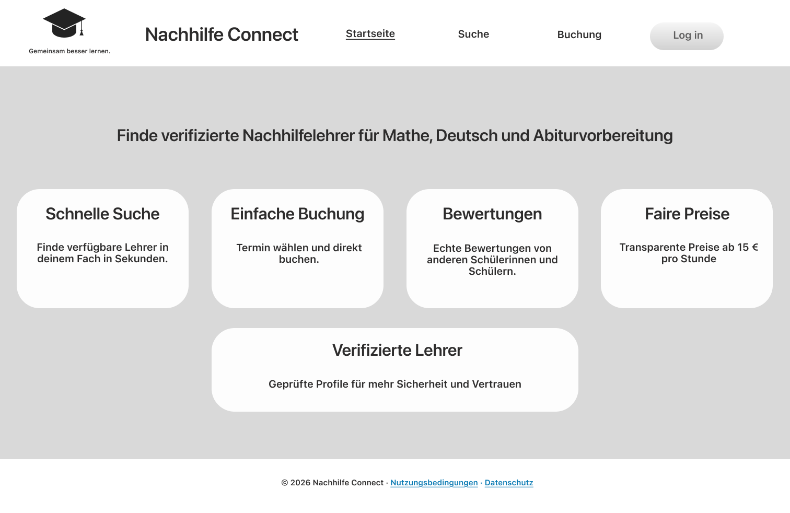

# Nachhilfe-Plattform

Webbasierte Plattform zur Vermittlung von privater Nachhilfe zwischen Schüler/innen und Lehrer/innen.

---

## Team 9
- Mohd Alkhtib  
- Benyamin Hasan 
- Abdullah Aldarwish  
- Emrah Rabotic  

---

## Persönliche Ziele

### Mohd Alkhtib
Mein Ziel ist es, eine Note zwischen 1,3 und 2,0 zu erreichen. Außerdem möchte ich meine Kenntnisse in der Webentwicklung vertiefen, praktische Erfahrung mit Git und GitHub sammeln und lernen, effektiv im Team an einem Softwareprojekt zu arbeiten.

### Benyamin Hasan
2.3 - 2.7 Einen Überblick über die groben Bereiche verschaffen. Vielleicht wird sich ein Schwerpunkt herauskristallisieren, den man später gezielt vertiefen kann.

### Abdullah Aldarwish
In 2er Bereich, ich möchte Ende des Kurses lernen wie man komplette digitale Anwendung von Anfang bis Ende entwickeln und verstehen zu können.

### Emrah Rabotic
Ich strebe eine  gute Note (z. B. im Bereich 2–3) an.
Ich möchte lernen, wie man vollständige digitale Anwendungen von Anfang bis Ende entwickelt und den gesamten Entwicklungsprozess dabei auch wirklich versteht.

---

## Value Proposition

- **Nutzer:** Schüler/innen und Nachhilfelehrer/innen  
- **Problem:** Schwierigkeiten bei der Suche nach passenden Nachhilfelehrern  
- **Lösung:** Eine Plattform, die Schüler/innen mit privaten Nachhilfelehrer/innen verbindet  

### Two-sided Plattform
- Schüler/innen suchen Nachhilfe  
- Lehrer/innen bieten Nachhilfe an  

---

##  Target Scope bzw. Geplante Screens
- Registrierung  
- Suche  
- Buchung  

---

## Ablauf der Nutzung

1. Schüler registriert sich  
2. Schüler sucht Lehrer  
3. Schüler wählt Lehrer aus  
4. Schüler sendet Buchungsanfrage  
5. Lehrer akzeptiert  

---

## UI Skizzen
### Registrierung / Login

### Lehrer finden / Suche

### Buchung

### Startseite
