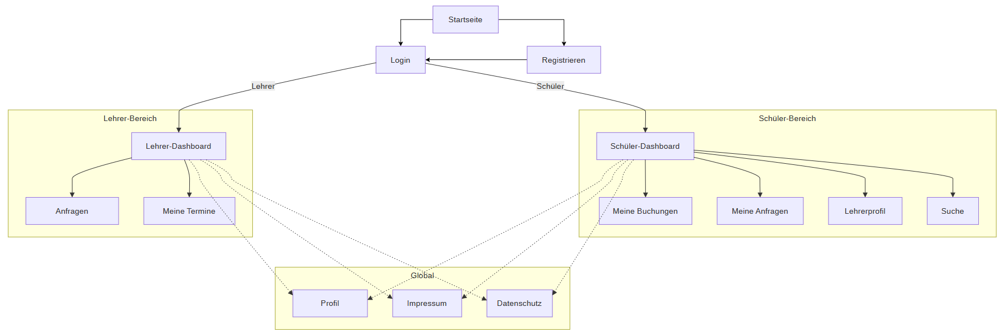
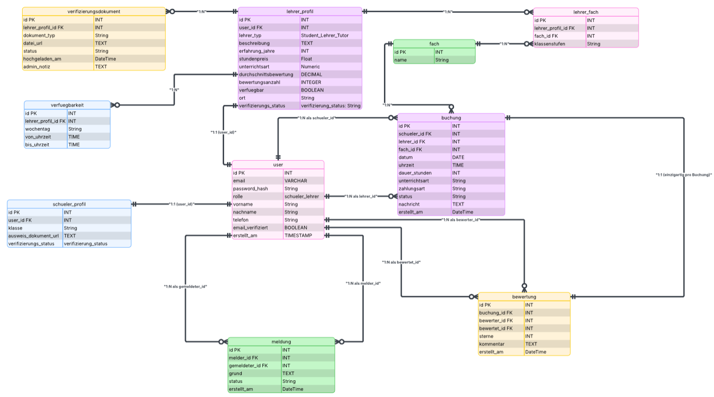

# Nachhilfe-Plattform

Webbasierte Plattform zur Vermittlung von privater Nachhilfe zwischen Schüler/innen und Lehrer/innen.

---

## Team 9
- Mohd Alkhtib  
- Benyamin Hasan 
- Abdullah Aldarwish  
- Emrah Rabotic  

---

## Persönliche Ziele

### Mohd Alkhtib
Mein Ziel ist es, eine Note zwischen 1,3 und 2,0 zu erreichen. Außerdem möchte ich meine Kenntnisse in der Webentwicklung vertiefen, praktische Erfahrung mit Git und GitHub sammeln und lernen, effektiv im Team an einem Softwareprojekt zu arbeiten.

### Benyamin Hasan
2.3 - 2.7 Einen Überblick über die groben Bereiche verschaffen. Vielleicht wird sich ein Schwerpunkt herauskristallisieren, den man später gezielt vertiefen kann.

### Abdullah Aldarwish
In 2er Bereich, ich möchte Ende des Kurses lernen wie man komplette digitale Anwendung von Anfang bis Ende entwickeln und verstehen zu können.

### Emrah Rabotic
Ich strebe eine  gute Note (z. B. im Bereich 2–3) an.
Ich möchte lernen, wie man vollständige digitale Anwendungen von Anfang bis Ende entwickelt und den gesamten Entwicklungsprozess dabei auch wirklich versteht.

---

## Zielgruppe

Unsere Plattform richtet sich an Schüler/innen der Klassen 10–13, die Unterstützung in Mathe und Naturwissenschaften suchen, insbesondere zur Vorbereitung auf Klausuren, MSA oder Abiturprüfungen.

Auf der Angebotsseite richtet sich die Plattform an Studierende, Tutor/innen und erfahrene Nachhilfelehrer/innen, die ihr Wissen flexibel online oder vor Ort anbieten möchten.

---

## Value Proposition

Viele Schüler/innen der Oberstufe haben Schwierigkeiten, vertrauenswürdige und passende Nachhilfelehrer/innen für Mathe und Naturwissenschaften zu finden. Angebote sind oft unübersichtlich, enthalten wenig Informationen oder bieten keine Möglichkeit, Qualität und Erfahrung der Lehrkräfte einzuschätzen.

Unsere Plattform löst dieses Problem, indem sie Schüler/innen gezielt mit geeigneten Nachhilfelehrer/innen verbindet. Nutzer/innen können Lehrerprofile nach Fach, Klassenstufe, Preis, Bewertung und Unterrichtsart (online oder vor Ort) filtern und vergleichen.

Lehrer/innen erhalten gleichzeitig eine Plattform, um ihre Qualifikationen sichtbar zu machen und Nachhilfestunden flexibel anzubieten.

### Two-sided Plattform
- Schüler/innen suchen Nachhilfe  
- Lehrer/innen bieten Nachhilfe an  

---

## Matching zwischen Schülern und Lehrern

Unsere Plattform unterstützt Schüler/innen dabei, schnell passende Nachhilfelehrer/innen zu finden. Dafür bietet die Anwendung verschiedene Such- und Filtermöglichkeiten, darunter Fach, Klassenstufe, Preis, Unterrichtsart (online oder vor Ort), Verfügbarkeit und Bewertungen.

Zusätzlich enthalten Lehrerprofile detaillierte Informationen wie Erfahrung, Qualifikation und kurze Beschreibungen ihrer Unterrichtsschwerpunkte. Ein Bewertungssystem hilft Schüler/innen dabei, vertrauenswürdige und geeignete Lehrkräfte leichter auszuwählen.

---

## Vertrauen und Sicherheit

Um Vertrauen zwischen Schüler/innen und Nachhilfelehrer/innen aufzubauen, bietet die Plattform verschiedene Sicherheits- und Qualitätsmechanismen.

Lehrerprofile enthalten Informationen zu Erfahrung, Qualifikation und Bewertungen früherer Schüler/innen.

Nachhilfestunden können bewertet werden, wodurch vertrauenswürdige Lehrkräfte leichter erkennbar sind. Außerdem ermöglicht ein Meldesystem das Melden unangemessenen Verhaltens oder unseriöser Profile. Administratoren können gemeldete Nutzer überprüfen und gegebenenfalls sperren.

### Verifizierung

Alle Nutzer/innen (Schüler/innen und Nachhilfelehrer/innen) müssen ihre Profile verifizieren, beispielsweise durch eine E-Mail-Bestätigung oder Telefonnummer.

#### Für Schüler/innen
Schüler/innen müssen ihren aktuellen Schülerausweis als Bild oder PDF hochladen, um ihren Schülerstatus zu bestätigen.

#### Für Studierende
Studierende, die Schüler/innen unterrichten möchten, müssen eine aktuelle Studienbescheinigung sowie ihren Studierendenausweis hochladen, um ihre Qualifikationen und Kenntnisse im gewünschten Unterrichtsfach nachzuweisen.

#### Für Lehrkräfte
Lehrkräfte, die Schüler/innen außerhalb ihrer regulären Arbeitszeiten unterstützen möchten, müssen eines der folgenden Dokumente zur Bestätigung ihrer Identität und ihrer Lehrtätigkeit einreichen:

- aktueller Arbeitsvertrag  
- Arbeitsbescheinigung des aktuellen Arbeitgebers  
- Arbeitszeugnis  

#### Für Tutor/innen
Tutor/innen müssen Nachweise einreichen, die ihre fachliche Qualifikation bestätigen, zum Beispiel:

- Bachelor-Abschluss oder vergleichbarer Abschluss  
- aktueller oder früherer Nachweis eines Nachhilfeinstituts / Nachhilfezentrums inklusive Informationen über die unterrichteten Fächer  

---

##  Target Scope bzw. Geplante Screens
- Startseite  
- Registrierung  
- Suche  
- Buchung  

---

## Ablauf der Nutzung

1. Schüler/in registriert sich  
2. Schüler/in sucht passende Nachhilfelehrer/innen  
3. Schüler/in filtert nach Fach, Preis, Bewertung und Verfügbarkeit  
4. Schüler/in wählt einen Lehrer aus  
5. Schüler/in sendet eine Buchungsanfrage  
6. Lehrer/in akzeptiert oder lehnt die Anfrage ab  
7. Nach der Nachhilfestunde kann eine Bewertung abgegeben werden  

---

## UI Skizzen
### Startseite

### Registrierung / Login

### Lehrer finden / Suche

### Buchung

---

## Vernetzungsplan
Um einen besseren Überblick über die Navigation unserer Webanwendung zu erhalten, haben wir einen Vernetzungsplan erstellt. Dieser zeigt, welche Seiten die Nutzer/innen aufrufen können und wie die einzelnen Bereiche miteinander verbunden sind.

Der Plan verdeutlicht die wichtigsten Seiten der Plattform sowie die möglichen Wege, die Schüler/innen während der Nutzung durchlaufen können. Die Startseite dient dabei als zentraler Ausgangspunkt, zu dem jederzeit zurückgekehrt werden kann.

---

## Datenmodell
Zur Planung der technischen Umsetzung haben wir ein Datenmodell erstellt. Dieses beschreibt, welche Informationen in der Anwendung gespeichert werden und wie die einzelnen Bereiche miteinander verbunden sind.

Das Datenmodell orientiert sich an unserem Happy Path und den Anforderungen unserer Nachhilfe-Plattform. 
### Die wichtigsten Bereiche
- User (Schüler/innen und Lehrer/innen)
- Lehrerprofile
- Schülerprofile
- Fächer
- Buchungen
- Bewertungen
- Verifizierung von Lehrkräften

Dadurch können passende Nachhilfelehrer/innen gefunden, Buchungen verwaltet und Bewertungen gespeichert werden.

### Datenmodell (Übersicht)

### Zentrale Entitäten
1. User: speichert die grundlegenden Informationen aller Nutzer/innen wie:
- Name
- E-Mail-Adresse
- Passwort
- Rolle (Schüler/in oder Lehrer/in)

2. Schülerprofil: Ergänzende Informationen zu Schüler/innen.

3. Lehrerprofil: Enthält Informationen zu Lehrkräften wie:
- Beschreibung
- Preis
- Qualifikation
- Verifizierungsstatus

4. Fach: Speichert die angebotenen Unterrichtsfächer.

5. Buchung: Verbindet Schüler/innen mit Lehrkräften und speichert Informationen zu gebuchten Nachhilfestunden.

6. Bewertung: Ermöglicht Schüler/innen die Bewertung abgeschlossener Nachhilfestunden.

7. Verifizierung: Unterstützt die Überprüfung von Lehrkräften durch hochgeladene Nachweise und erhöht das Vertrauen in die Plattform.

### Benutzerrollen
#### Schüler/in
Kann:
- Konto erstellen
- Anmelden
- Profil verwalten
- Lehrer suchen
- Lehrerprofile ansehen
- Nachhilfestunden buchen
- Bewertungen abgeben
- Eigene Buchungen verwalten

#### Lehrer/in
Kann:
- Konto erstellen
- Anmelden
- Profil verwalten
- Fächer und Preise festlegen
- Buchungsanfragen erhalten
- Buchungsanfragen annehmen oder ablehnen
- Bewertungen erhalten

---

## Weitere Dokumentation

- [Evidence / Nachweise](Evidence/evidence.html)
